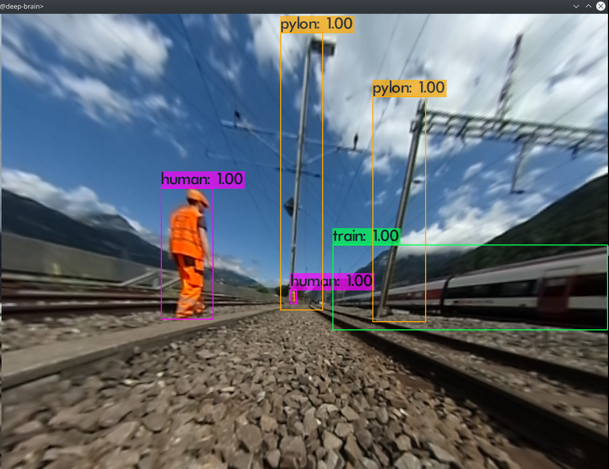
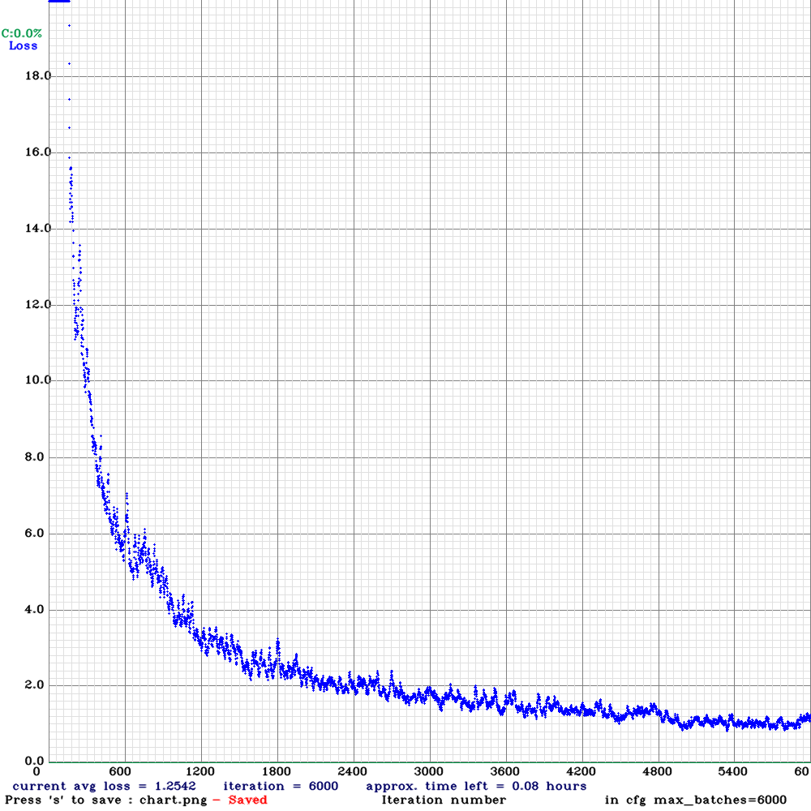

# HSLU Project for SBB - S-Bot

For autonomous navigation a neural network yolov3 from [AlexeyAB](https://github.com/AlexeyAB/darknet) is used for training validation and testing.
A gaming computer was used and followed by this [manual](https://github.com/AlexeyAB/darknet#how-to-train-to-detect-your-custom-objects).

## Procedure
### Data
Image sets were counted, sorted and merged with a [python script](./count_sort.py).
For training, validation and testing another [python script](./darknet_scripts/create_txt.py) was used to make a list of all images to feed the computer.

### Labeling
For Labeling [VoTT](https://github.com/microsoft/VoTT) was used. Training and Testing was divided into two projects.
This created a `.json` Document with all the bounding boxes for each image. But for the neural network of AlexeyAB `.txt` files for the bounding boxes and `.jpg` images were needed to feed into the network.

To transform the data from VoTT JSON Format into YOLO file Format [vott2yolo](https://cnpmjs.org/package/vott2yolo) was used.

### Training
After training with 200 labeled training images with the pre-trained weights-file (yolov4.conv.137), a chart and new weights were the output.

### Testing
A video was fed into the network to see if and how objects are detected.

### Validation
After Testing, a validation set with 100 labeled images were fed into the network. The output then was analysed with another [python script](./darknet_scripts/neural_net_score.py).

#### 

